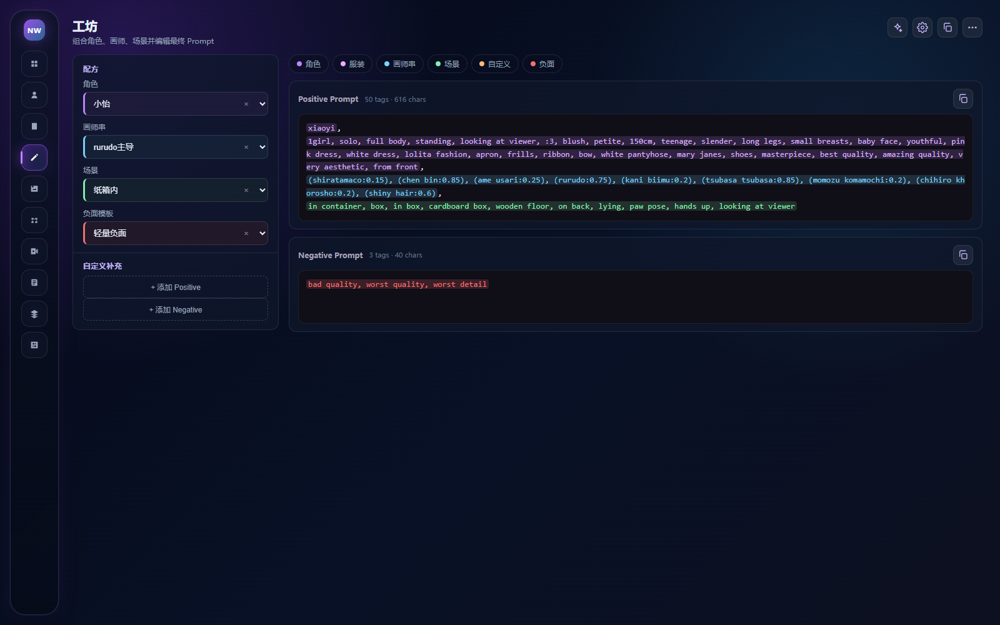
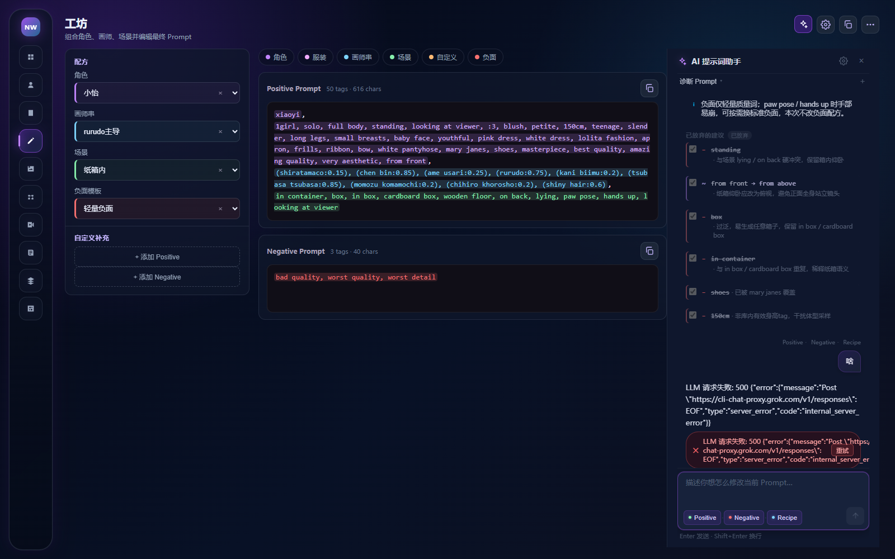
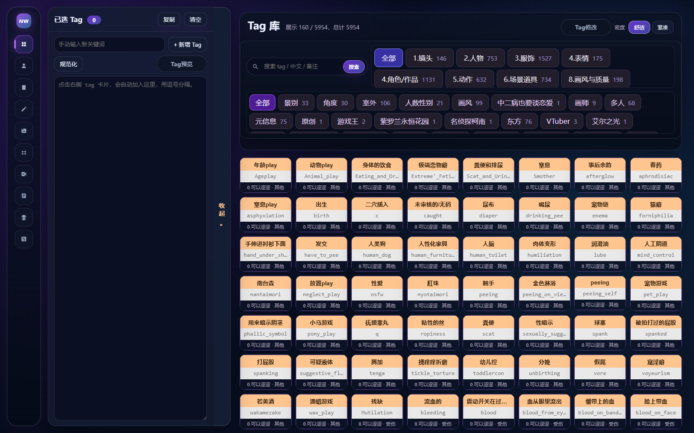
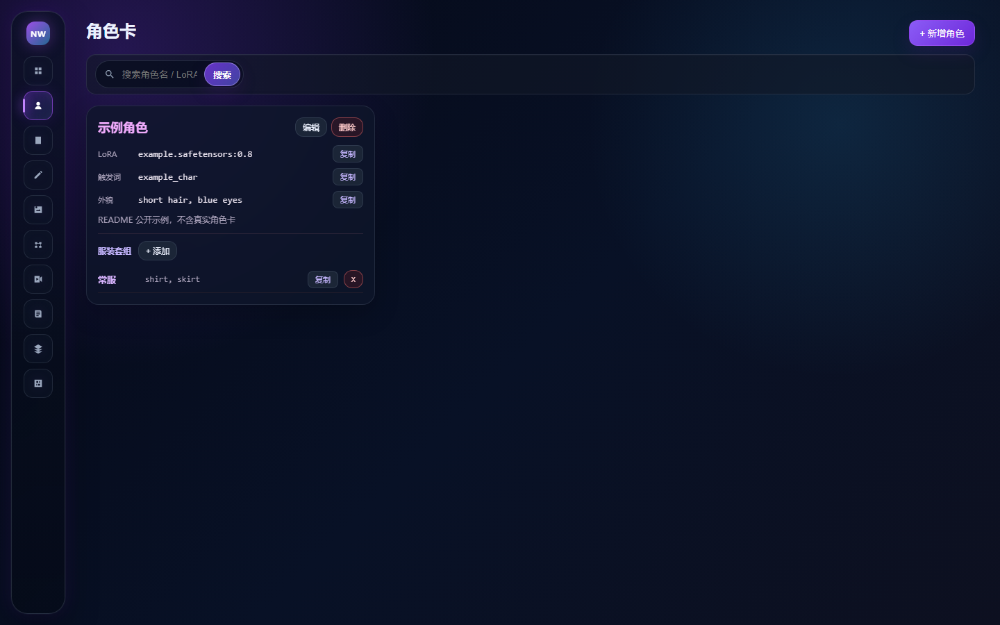

# 夜之主衣柜 / Night Wardrobe

面向 Stable Diffusion / NoobAI 工作流的本地 Tag、角色卡、配方、图库与提示词工坊管理器。默认跑在本机，数据留在本机。

当前版本：**v1.22.0**

## 功能亮点

- **Tag 库** — 按一级 / 二级分类浏览与检索，点击即选；提供开放 API，方便其他 Agent 查询和维护
- **角色卡** — 管理 LoRA、触发词、外观和可切换服装套组
- **配方库** — 保存画师串、场景、负面模板和绘图参数，卡片上一键复制
- **提示词工坊** — 组合角色、画师、场景，实时编辑 Positive / Negative Prompt
- **工坊 Copilot** — 复用本地 LLM 设置，输出结构化诊断与 Diff；必须勾选后显式 Apply 才会写回 Prompt。支持 function-calling 只读查询 Tag 库、配方和角色卡。正式会话写入本机 SQLite，刷新或离开工坊后可恢复；历史 Diff 在当前 Prompt 已变化时进入 stale 态，需重新检查后再应用
- **图库** — 扫描本地图片、解析 ComfyUI / 生成元数据、按文件夹管理

附加工具（按需使用，不作为核心承诺）：LoRA 库、漫画下载、视频解密（解密核心已内置，兼容加密插件 2.0 的 `.evideo`，无需外部解密仓库或本地配置文件）、工作流库、AI 抽卡。

## 界面预览

以下截图来自隔离的公开示例数据（如「示例角色」、常见质量词），不含真实用户图库、私密角色卡或密钥。图库为尚未导入图片时的空态。

| 工坊 | Copilot |
| --- | --- |
|  |  |

| Tag 库 | 图库（空态） | 角色卡 |
| --- | --- | --- |
|  |  |  |

本地运行后可自行补拍配方库、LoRA 库等页面，保存到 `assets/screenshots/` 并用相对路径引用。

## 快速开始

### 环境

- 推荐 Python 3.11+
- 可选：Node.js 18+（仅在修改工坊 Copilot 前端源码后需要重新构建）

### 安装与启动

```bash
git clone https://github.com/JadeCake5/night-wardrobe.git
cd night-wardrobe
pip install -r tag_manager/requirements.txt
python -m tag_manager.run
```

浏览器打开 <http://127.0.0.1:8765>

Windows 也可双击根目录 `start.bat`：首次运行会创建虚拟环境并安装依赖，随后启动服务。

## LLM 设置

1. 打开工坊，点击右上角齿轮
2. 填写 OpenAI 兼容接口：Base URL、API Key、Model（以及可选的默认 system prompt）
3. 保存后，工坊 Copilot 与抽卡页共用这份服务端配置

密钥只写入本机 SQLite，不会进入前端源码或构建产物。Copilot 不会自动改写 Prompt：需要逐条勾选，再点「应用选中项」或「应用全部」。

`/llm` 仍可作为兼容设置页，但不再作为主导航入口。

## 开放 API

- 根路径：<http://127.0.0.1:8765/api/v1>
- 交互文档：<http://127.0.0.1:8765/docs>
- OpenAPI：<http://127.0.0.1:8765/openapi.json>
- 当前 **20** 个操作（`/api/v1` 下各路径的 HTTP 方法合计）

常用接口：

| 方法 | 路径 | 说明 |
| --- | --- | --- |
| GET | `/api/v1/tags` | 分页查询；支持关键词、分类、评分筛选 |
| GET | `/api/v1/tags/{id}` | 读取单条 |
| POST | `/api/v1/tags` | 创建 |
| PUT / PATCH / DELETE | `/api/v1/tags/{id}` | 替换、部分更新、删除 |
| POST | `/api/v1/tags/lookup` | 按英文名批量查询，返回命中与缺失名单 |
| POST | `/api/v1/tags/bulk-upsert` | 批量创建或覆盖，单次最多 500 条 |
| POST | `/api/v1/tags/bulk-delete` | 按 ID 或英文名批量删除 |
| GET / POST | `/api/v1/categories` | 列出或创建一级分类 |
| GET / PATCH / DELETE | `/api/v1/categories/{id}` | 读取、更新、删除分类 |
| GET | `/api/v1/subcategories` | 列出派生二级分类 |
| POST | `/api/v1/subcategories/rename` | 重命名二级分类 |
| POST | `/api/v1/subcategories/clear` | 清空二级分类归属 |
| GET | `/api/v1/tag-library` | 库摘要（数量与最近更新） |
| GET | `/api/v1/tag-library/export` | 导出完整 Tag 库 JSON |
| POST | `/api/v1/tag-library/import` | 单事务导入或覆盖，最多 20000 条 Tag |

## 数据与隐私

本项目默认只监听 `127.0.0.1`，数据保存在本机 SQLite。图库图片、工作流 JSON、LoRA 预览分别放在 `tag_manager/gallery/`、`tag_manager/workflows/`、`tag_manager/lora_previews/`。

仓库**不包含**用户数据库、私有 Tag 库、用户图片或 API Key。请不要把这些文件提交到 Git：

- 本地 SQLite 数据库及其 WAL/SHM
- 私有 Tag 库 JSON 导出
- `tag_manager/gallery/`、`tag_manager/workflows/` 中的个人文件
- LoRA 预览、漫画下载产物、视频解密产物
- `.env` 与任何密钥文件

`.gitignore` 已排除上述路径。克隆后首次启动会自动初始化空库。

## 开发与测试

在仓库根目录运行单元测试：

```bash
python -m unittest discover -s tag_manager/tests -v
```

核对应用版本与 `/api/v1` 操作数：

```bash
python -c "from tag_manager.app import app; s=app.openapi(); print(app.version); print(sum(len(v) for k,v in s['paths'].items() if k.startswith('/api/v1')))"
```

修改工坊 Copilot 前端（`tag_manager/frontend/copilot`）后需要重新构建。仓库已包含 `tag_manager/static/copilot/` 产物，仅用 `start.bat` 或 `python -m tag_manager.run` 启动时不需要 Node：

```bash
cd tag_manager/frontend/copilot
npm install
npm run build
```

## 版本

**v1.22.0** 最近亮点：

- 视频解密核心内置（AES-256-GCM / Scrypt，兼容加密插件 2.0 生成的 `.evideo`），开箱即用，不再需要配置外部仓库
- 解密任务卡片实时显示进度百分比，页面直接展示解密核心版本
- 一键脚本 `start.bat` 智能化：自动选择本机 ≥3.11 的最佳 Python，依赖不变时跳过重装，找不到合格解释器时给出 winget / 官网安装指引
- 含 v1.21.0：Workshop Copilot Session 持久化到本机 SQLite，刷新可恢复 Diagnosis / Diff / Apply 状态；Session History 改为 IDE 式扁平触发条

## 致谢 / Credits

本仓库中的 **AI 抽卡** 是集成功能，前端来自「SD Nai Newbie 抽卡 - AI 提示词生成器」。署名以集成页面 `tag_manager/static/gacha/index.html` 设置页为准：

- 原项目：逐辰十七
- 二改版：渊//愿

感谢原作者与二改作者。本仓库只做本地衣柜集成（共用服务端 LLM 配置、将非敏感抽卡数据写入本机数据库等），抽卡界面本身的设计与实现归原作者所有。

## License

[MIT](LICENSE) © 2026 Shiratamakeki
